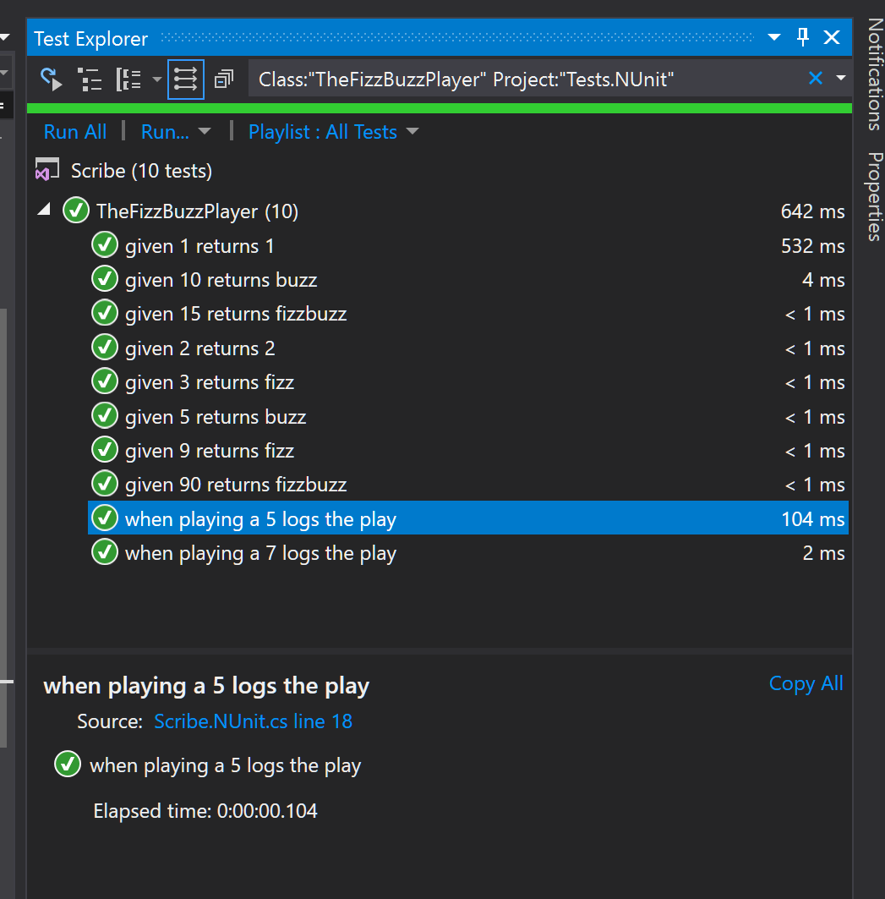

# Scribe
 

### Your C# Tests are ugly. So were mine.
	
    [TestClass]
    public class FizzBuzzTests
    {
      FizzBuzzPlayer _player;
      ILogger _logger;

      [TestInitialize]
      public void Setup()
      {
        _logger = A.Fake<ILogger>();
        _player = new FizzBuzzPlayer(_logger);
      }
      
      [TestClass]
      public class WhenPlayingA5 : FizzBuzzTests
      {
        [TestMethod]
        public void LogsThePlay()
        {
          _player.Play(5);
          A.CallTo(() => _logger.Log("The fizz-buzz of 5 is buzz.")).MustHaveHappened();
        }
      }

      [TestClass]
      public class WhenPlayingA7 : FizzBuzzTests
      {
        [TestMethod]
        public void LogsThePlay()
        {
          _player.Play(7);
          A.CallTo(() => _logger.Log("The fizz-buzz of 7 is buzz.")).MustHaveHappened();
        }
      }
    }

We can do better. 

#### That's what Scribe is for.

    public partial class TheFizzBuzzPlayer : Spec
    {
      public TheFizzBuzzPlayer()
      {
        BeforeEach(() =>
        {
          _player = new FizzBuzzPlayer(A.Fake<ILogger>());
        });
          
        Describe("when playing", () =>
        {
          ILogger _logger = null;
          BeforeEach(() =>
          {
            _logger = A.Fake<ILogger>();
            _player = new FizzBuzzPlayer(_logger);
          });
  
          Describe("a 5", () =>
          {
            BeforeEach(() =>
            {
              _player.Play(5);
            });
  
            It("logs the play", () =>
            {
              A.CallTo(() => _logger.Log("The fizz-buzz of 5 is buzz.")).MustHaveHappened();
            });
          });
  
          Describe("a 7", () =>
          {
            BeforeEach(() =>
            {
              _player.Play(7);
            });
  
            It("logs the play", () =>
            {
              A.CallTo(() => _logger.Log("The fizz-buzz of 7 is 7.")).MustHaveHappened();
            });
          });
        });
      }
    }
    
With Scribe, you can write your C# tests in the RSpec style that you know and love (from, like, [every](https://jasmine.github.io/) [other](https://github.com/Quick/Quick) [testing](http://rspec.info/) [framework](https://mochajs.org/) out there). 

### It's not *yet another* testing framework

Scribe is just some syntactic sugar, a pinch of love, and a [T4](https://docs.microsoft.com/en-us/visualstudio/modeling/code-generation-and-t4-text-templates?view=vs-2017) template that generates the actual test code--after that, your favorite tools and infrastructure still apply.

Available in three popular flavors: [MSTest](https://docs.microsoft.com/en-us/dotnet/core/testing/unit-testing-with-mstest), [NUnit](https://nunit.org/), and [xUnit](https://xunit.github.io/). 

[FakeItEasy](https://fakeiteasy.github.io/) not included.

